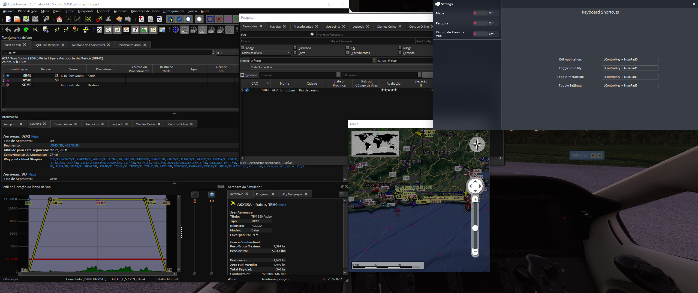
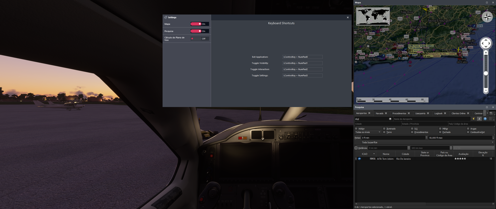

# msfs2020-little-nav-map-docker
LittleNavMap windows docker

Download and run `Release\MSFS2020 LNM Docker.exe` as administrator, start LNM and undock the windows you want.

Right click in the trayicon and open settings to configure.

Double click in the settings window keyboard shortcut field to change it.

It probably contains some bugs with the docker engine, just report it to be fixed.

## screenshots

